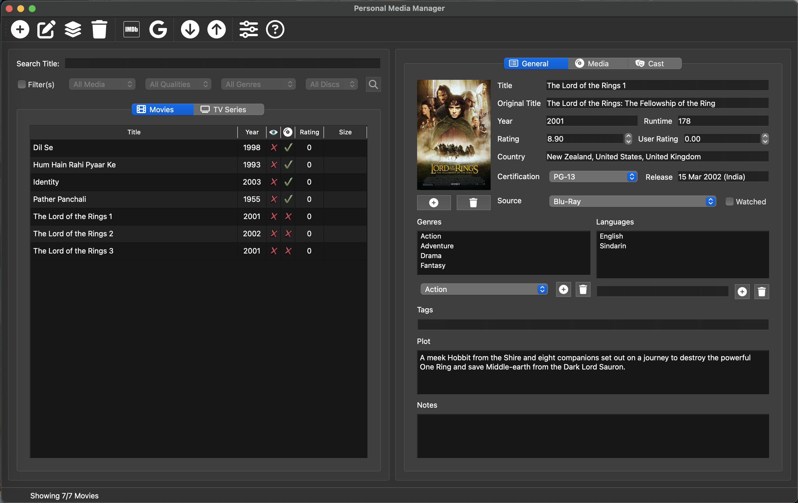
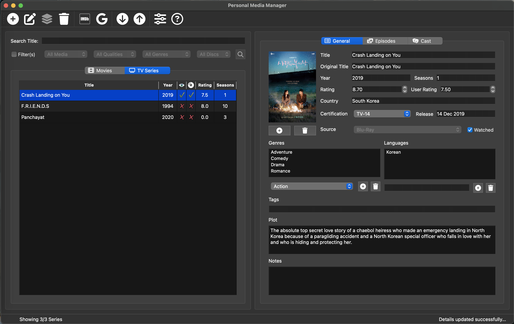
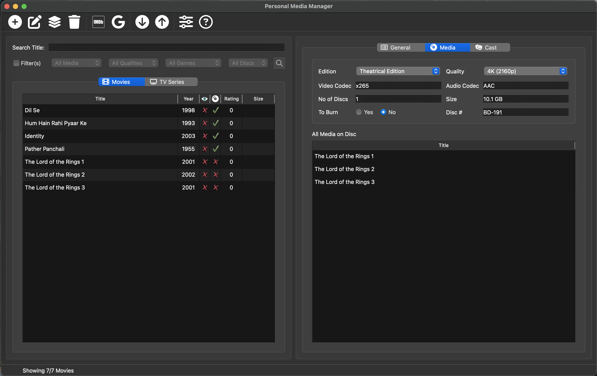
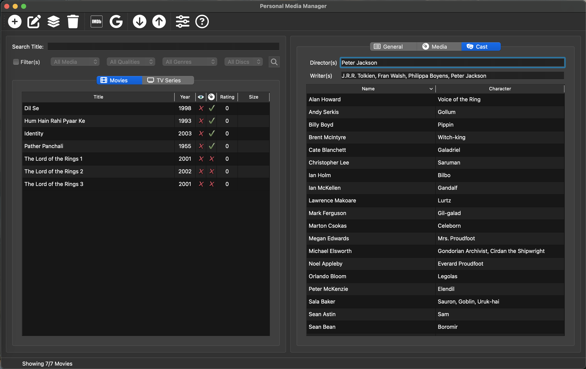
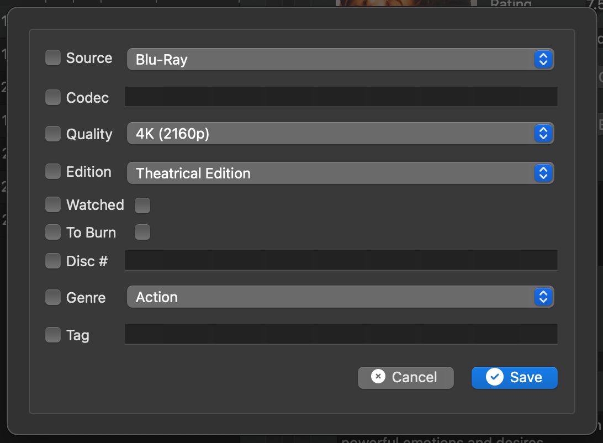
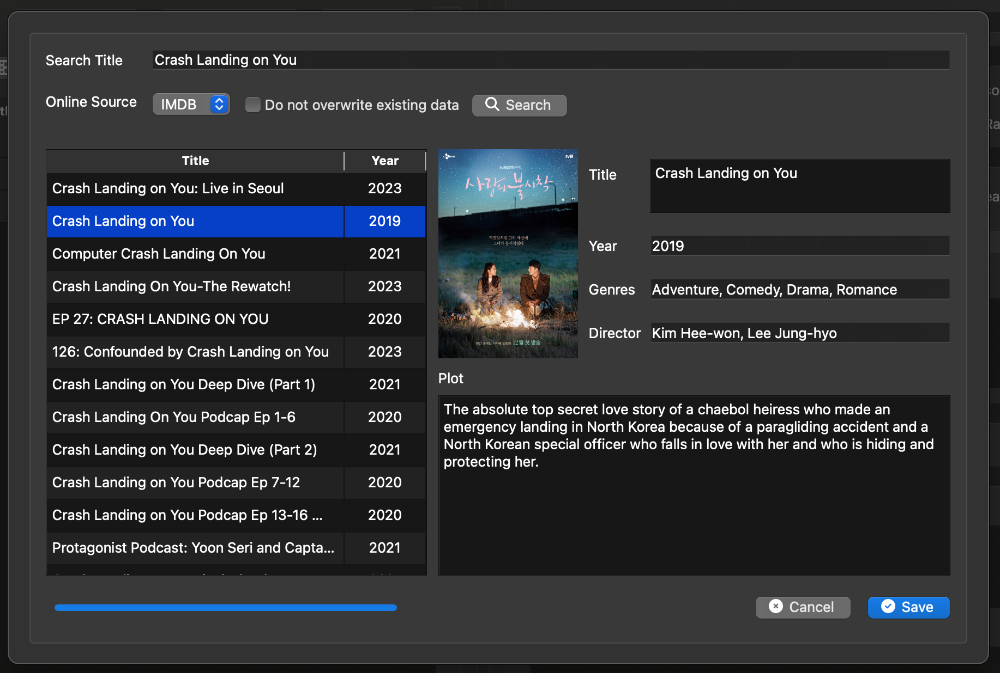
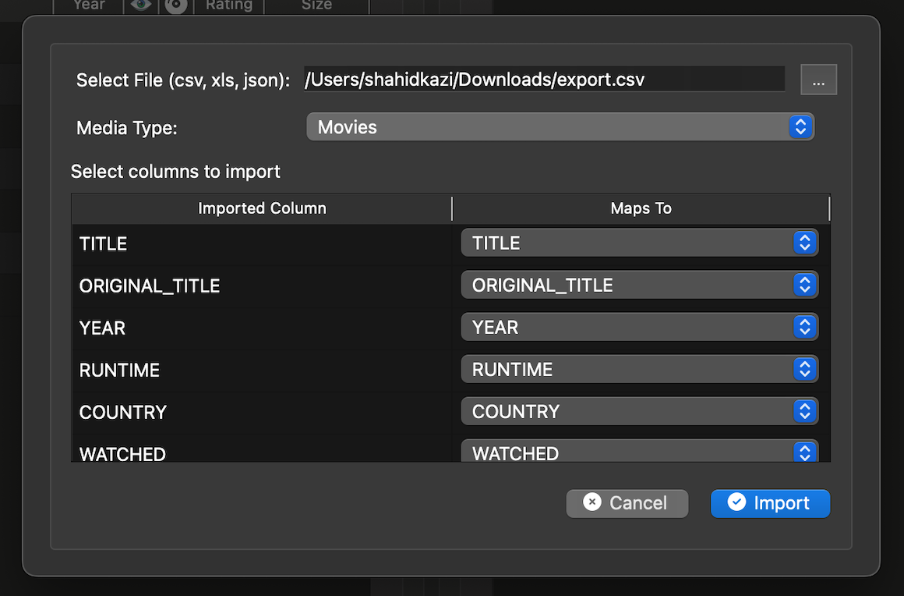
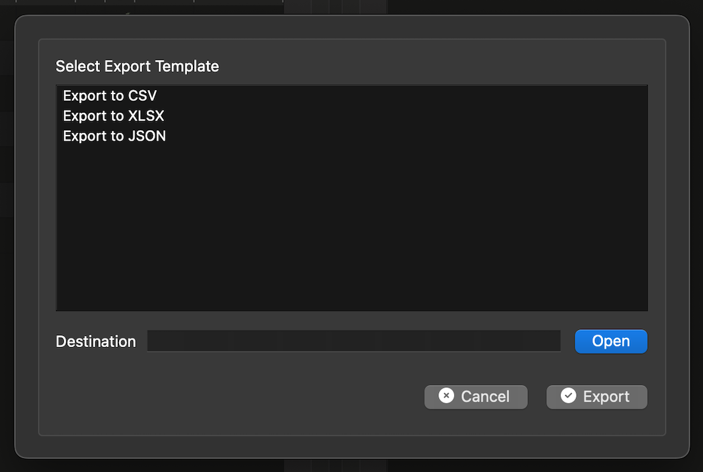
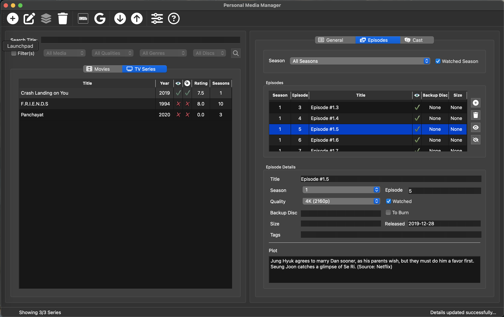

<div align="center">
    <br/><br/>
    <b>Python based Movie and TV Series collection manager</b><br/><br/>
</div>

# Description

Tired of trying to find a media manager for your DVDs, Blu-Rays and Downloads? I was... The ones I found we either too expensive or had too much than one can manage.

So I decided to build one, open source, so anyone can use and  extend as needed (with due credit ofcourse).

So enjoy collecting and managing your Movies and TV Series...<br/><br/>

https://github.com/shahidkazi/personal_media_manager/edit/main/README.md

# Important Links
- [What's New in v1.1.0?](#whats-new-in-v110)
- [Current Features](#current-features)
- [Installation](#installation)
- [Plans for the Future](#plans-for-the-future)

# What's New in v1.1.0?

- The Movie/Series/Episode list does not scroll back to top after refreshing post update/fetch and other operations
- Added support for Backup and Restore of the database. Helpful when upgrading to newer versions which is currently manual<br/><br/>

# Current Features

- Add Movies and Tv Series from Media -> Add New menu or the '+' icon on the toolbar<br/><br/>
  <br/><br/>
  <br/>
- Add custom Genres and Languages from the General Tab
- Add/Remove Poster from the General Tab
- Update any properties in the General, Media, Episodes tabs and use Update Media to Save<br/><br/>
  <br/><br/>
  <br/>
- Use Media -> Delete or the Delete Icon on the Toolbar to delete movies / series (multi-select supported)
- Use Media -> Bulk Update to update common properties for multiple selected movies (not supported for series)<br/><br/>
  <br/>
- Use Media -> Fetch Details or the IMDB icon to get details of the movie/series from IMDB (multi-select supported)<br/><br/>
  <br/>
- You can build custom scrapers and add to the templates directory following implementing the required methods and making an entry in registry.json
- Use Media -> Import / Export to import and export from and to popular formats like CSV/XLSX/JSON<br/><br/>
  <br/><br/>
  <br/>
- You can build custom importers and exporters like above
- Publish is similar to export but with additional functionality. Have added a sample publisher for Firebase. You can build ones for creating web sites or publishing to other online sources.
- The Episodes Tab (only visible for series) you can view / add / delete episodes (multi-select supported except for edit)<br/><br/>
  <br/>
- The Media Tab lets you set media details for Movies and in case you have added a disc tag for the media shows you which other media has the same tag (on the same disc)
- Backup/Restore you Movie Database to local drives for not lose work or upgrade the app to newer version.
<br/><br/>

# Installation

I am improving this on a regular basis, but until I can get it to standalone installer, the process is a bit manual.

Current releases are for Mac OS only, Windows and Linux coming soon. If you are tech savvy, you can clone the code and package/use it for yourself.

<b>New Installation Pre-requisites</b>
- Download and Install Python (www.python.org)
- Install the following packages<br /><br/>
  ```bash
  pip install --upgrade pip
  pip install requests
  pip install pandas
  pip install PySide6
  pip install cinemagoer
  ```

<b>Upgrading Existing</b>
- For version older than v1.1.0
    - Open Finder
    - Go to Applications Folder
    - Right Click Personal Media Manager and select 'Show Package Contents'
    - Browse to the 'data' folder and copy 'moviedb.db' to another local folder
    - Delete the 'Personal Media Manager' app
- For versoion v1.1.0+
    - Start the appilication and Use Backup Functionality to backup your database to a local folder 


<b>Next steps (New & Existing Upgrade)</b>
- Download the latest release depending on your operating system and unzip the files
- For MacOS, move the .app file to Applications Folder in Finder
- If you have upgraded, then in the application, use the Restore functionality to restore the backed up database
<br/><br/>

# What's planned for the future

- Support for backing up and restoring database from your personal cloud
- Releases for Windows and Linux
- Updating app from within instead of having to manually rebuild/replace with DB backup<br/><br/>

Please do reach out to me at <a href="mailto:shahidskazi@hotmail.com">shahidskazi@hotmail.com</a> or leave message on GitHub and I shall try my best to get back to you.
